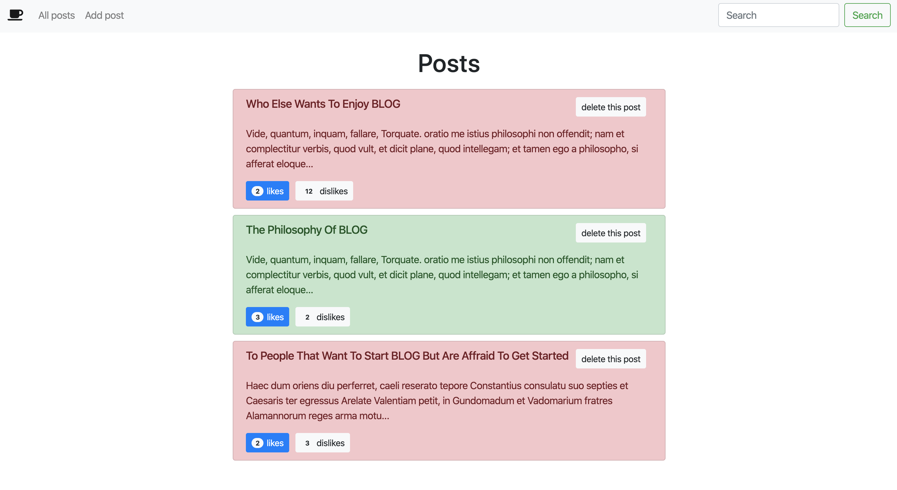

# MyBlogTutoOpenClassroom

This project was generated with [Angular CLI](https://github.com/angular/angular-cli) version 8.3.0.

## Dependencies infos :

this project use the bootstrap 4.3.1 version

## Clone help :

To clone the project make sure that you've installed :
- git & nodeJS (on you computer)
- angular/cli (`npm install -g @angular/cli`)
- launch `git clone https://github.com/RonanGir/my-blog-tuto-open-classroom.git` in your terminal

## To launch this project locally :
- Open your terminal (command line tool) and run : `ng serve --open` | this will open your default browser at `http://localhost:4200/`
